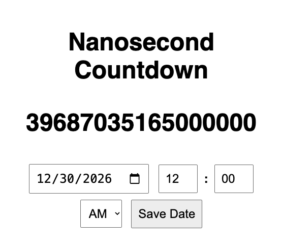

# ⏱️ Nanosecond Countdown Website

A simple **nanosecond countdown/up timer** built with **HTML, CSS, and JavaScript**.  
- Displays the countdown in **total nanoseconds** (no commas, no breakdown).  
- Keeps counting **up** after reaching `0`.  
- Lets you **set a custom target date** in **12-hour AM/PM format**.  
- Saves your chosen date in **localStorage** (so it persists after refresh).  
- Minimal design: **bold black text on a plain white background**.  

---

## 🚀 Features
- ⚡ **Nanosecond illusion** (updates every millisecond, but shows nanoseconds).  
- 📅 **Custom date selector** with **AM/PM support**.  
- 💾 **Persistent storage** of your chosen date.  
- 🎨 **Lightweight, no libraries**, pure HTML/CSS/JS.  

---

## 📸 Preview
  
*(Add your own screenshot here)*

---

## 🔧 How to Use
1. Open the site.  
2. Enter a **date + time (AM/PM)**.  
3. Hit **Save Date**.  
4. Watch the countdown race in **nanoseconds**!  

---

## 🌍 Live Demo
👉 [View on GitHub Pages](https://IMPERVIOUSKING1202.github.io/nanosecond-countdown/)  

---

## 📂 Project Structure
